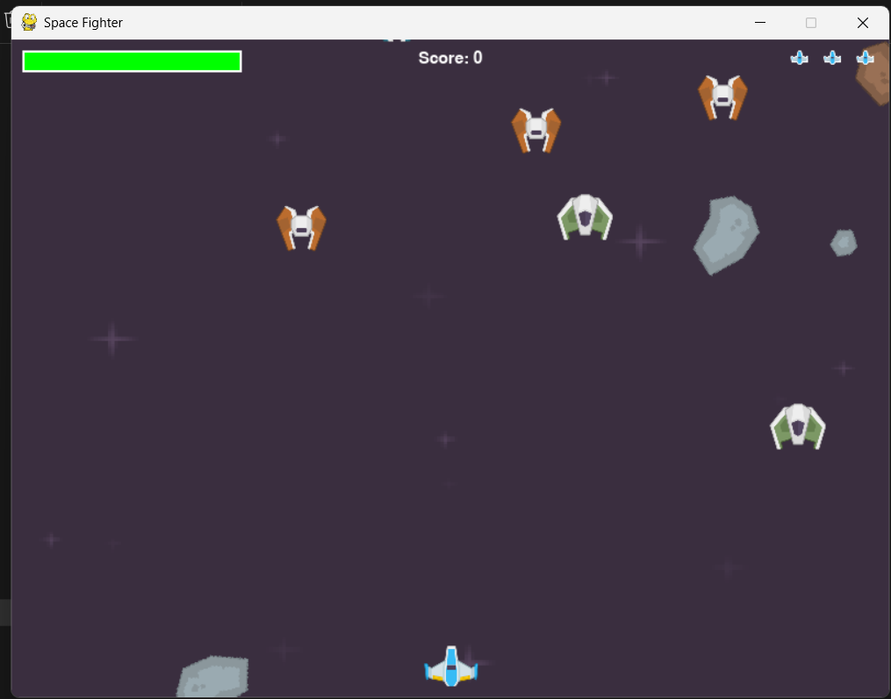

# 🚀 Space Fighter

A modern 2D space shooter game built with Python and Pygame, combining classic arcade gameplay with contemporary features.



## ✨ Features

- 🎮 Fast-paced space combat with multiple enemy types
- 🛡️ Dynamic power-up system
- 🎯 Progressive difficulty scaling
- 🏆 Score tracking and achievements
- 🎨 Customizable ship colors and backgrounds
- 🎵 Immersive sound effects and music
- 🎯 Precise collision detection
- 💫 Particle effects and smooth animations

## 🎮 Quick Start

### Prerequisites
- Python 3.8 or higher
- Pygame 2.0 or higher

### Installation

1. Clone the repository:
```bash
git clone https://github.com/akashadsare/Space_fighter.git
cd Space_fighter
```

2. Install dependencies:
```bash
pip install -r requirements.txt
```

3. Run the game:
```bash
python main.py
```

### Download Pre-built Version
- Download the latest release from the [Releases page](https://github.com/akashadsare/Space_fighter/releases)
- Extract the ZIP file
- Run `SpaceFighter.exe`

## 🎯 Controls

- **Movement**: Arrow keys or WASD
- **Shoot**: Space bar
- **Pause**: ESC key
- **Restart**: R key

## 🛠️ Development

### Project Structure
```
Space_fighter/
├── main.py              # Main game file
├── assets/             # Game assets
│   ├── images/        # Sprite images
│   ├── sounds/        # Sound effects
│   └── fonts/         # Game fonts
├── screenshots/        # Game screenshots
├── requirements.txt    # Python dependencies
└── README.md          # This file
```

### Building from Source

1. Install build dependencies:
```bash
pip install -r requirements.txt
```

2. Build the executable:
```bash
python build.py
```

The executable will be created in the `dist` directory.

## 🎨 Customization

### Ship Colors
- Blue (Default)
- Orange
- Green
- Red

### Background Themes
- Classic Space
- Nebula
- Star Field
- Dark Matter

## 🚀 Future Plans

- [ ] New enemy types and boss battles
- [ ] Additional power-ups and weapons
- [ ] Online leaderboards
- [ ] Special challenge modes
- [ ] More customization options

## 🤝 Contributing

Contributions are welcome! Please feel free to submit a Pull Request.

1. Fork the repository
2. Create your feature branch (`git checkout -b feature/AmazingFeature`)
3. Commit your changes (`git commit -m 'Add some AmazingFeature'`)
4. Push to the branch (`git push origin feature/AmazingFeature`)
5. Open a Pull Request

## 📝 License

This project is licensed under the MIT License - see the [LICENSE](LICENSE) file for details.

## 👨‍💻 Author

**Akash Adsare**
- GitHub: [@akashadsare](https://github.com/akashadsare)
- Project Link: [https://github.com/akashadsare/Space_fighter](https://github.com/akashadsare/Space_fighter)

## 🙏 Acknowledgments

- Pygame community for the excellent game development library
- All contributors and supporters of the project
- Classic arcade games that inspired this project

## 📞 Support

If you encounter any issues or have suggestions, please:
1. Check the [Issues](https://github.com/akashadsare/Space_fighter/issues) page
2. Create a new issue if your problem isn't already listed
3. Provide detailed information about the problem

---

⭐ Star this repository if you like it! 